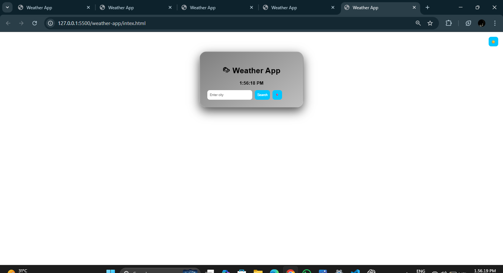
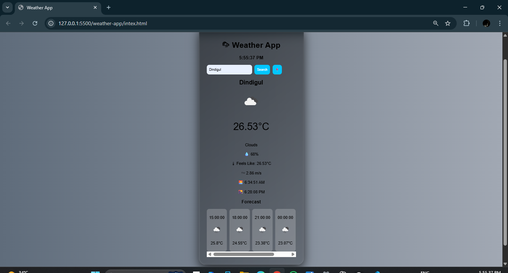
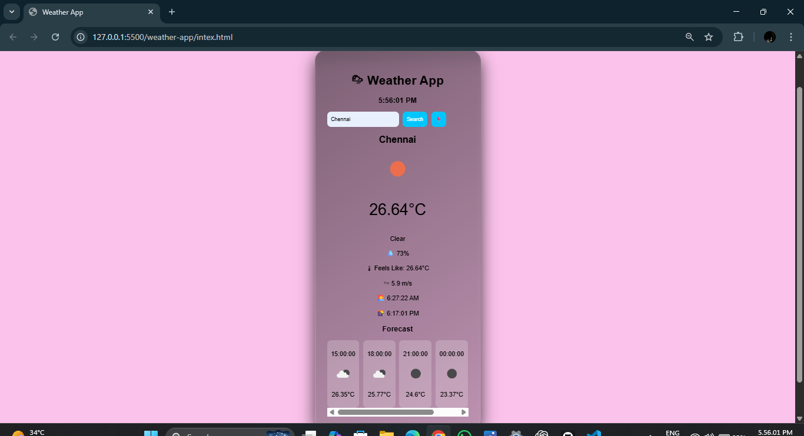
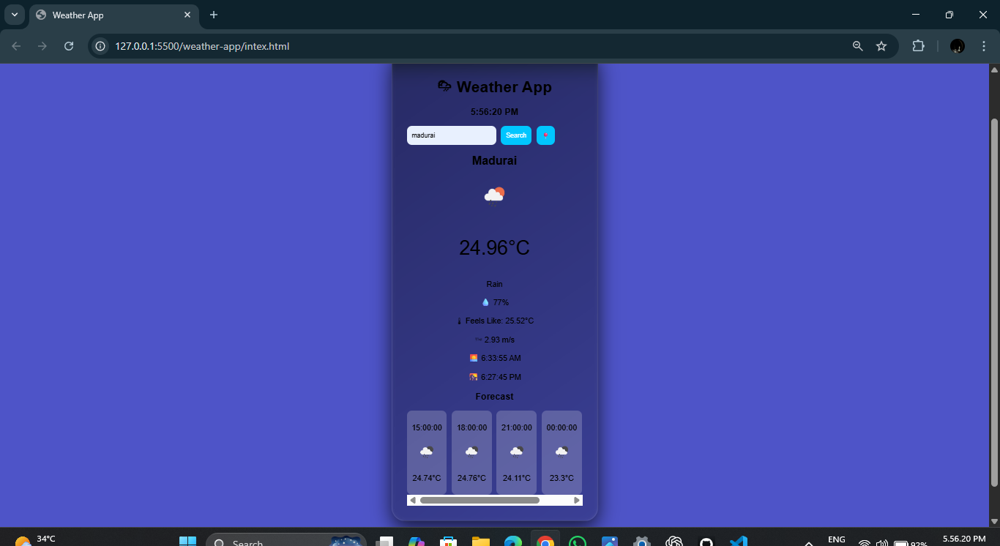
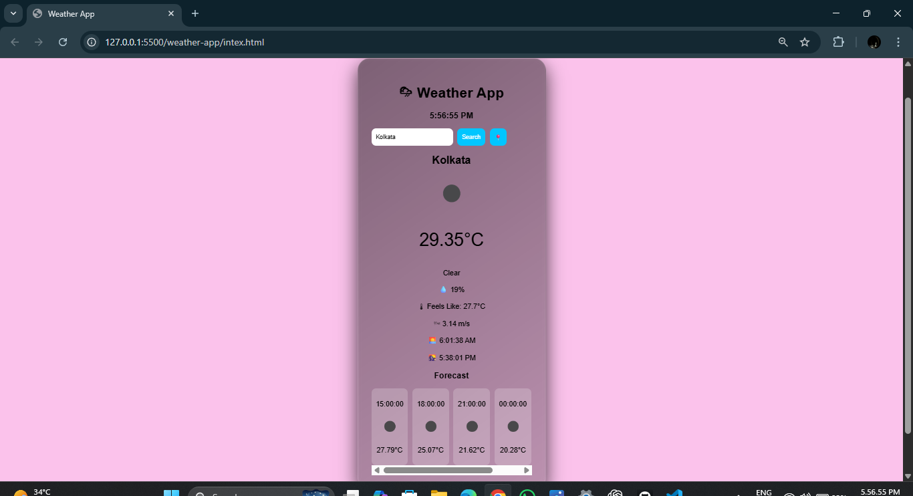
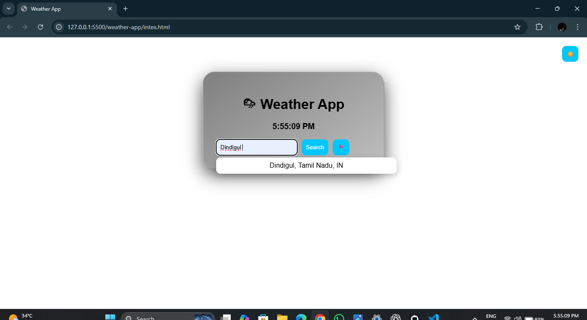

# 🌦 Weather App

Modern Weather Application built using HTML, CSS & JavaScript.

## Features
- Real-time weather
- Forecast
- GPS location
- Dark & Light mode
- Autocomplete

## 📸 Screenshots

### Home UI

### Weather Result 1

### Weather Result 2

### Weather Result 3

### Forecast

### Autocomplete

## Setup
Replace "YOUR_API_KEY_HERE" in script.js with your own API key from:
https://openweathermap.org/
